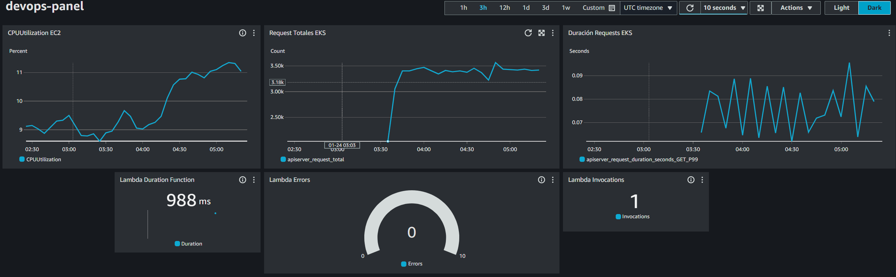

# **Prueba Técnica para DevOps Senior**

Este documento detalla cómo configurar una arquitectura en AWS para soportar un modelo de transcripción basado en IA. Es necesario configurar credenciales de AWS mediante `aws-cli` para gestionar recursos.

---

## **Requisitos**

- **Python:** 3.8.x o superior  
- **Terraform:** 1.10.4 o la versión más reciente  
- **Docker** y **DockerHub**

---

## **1. Infraestructura en la Nube**

La creación de los recursos puede realizarse mediante la CLI de AWS o directamente desde la consola de Amazon, ajustando dinámicamente cada parámetro.

### **Comandos de ejemplo**

Crear una instancia EC2:  
```bash
aws ec2 run-instances \
  --image-id ami-0abcdef1234567890 \
  --instance-type t2.micro \
  --security-group-ids sg-903004f8 \
  --subnet-id subnet-6e7f829e
```

Crear un bucket S3:  
```bash
aws s3api create-bucket --bucket my-bucket --region us-west-2
```

Crear un clúster EKS:  
```bash
aws eks create-cluster \
  --name my-cluster \
  --role-arn arn:aws:iam::<account-id>:role/<role-name> \
  --resources-vpc-config subnetIds=<subnet-1>,<subnet-2>,securityGroupIds=<security-group>
```

De forma automática, se asignará una VPC con subredes según los parámetros por defecto, aunque es posible personalizarlos a nivel de usuario o rol.

### **Arquitectura propuesta**

La arquitectura planteada es la siguiente:  
](assets/architecture.jpg)

---

## **2. Pipeline de CI/CD**

El pipeline está basado en **GitHub Actions** y permite la integración continua (CI) y el despliegue continuo (CD) del modelo de transcripción en el clúster de EKS creado previamente. Incluye:  

- **Pruebas unitarias**  
- **Construcción de imágenes Docker en DockerHub**  
- **Despliegue automatizado**  

### **Configuración**

1. **GitHub Secrets:**  
   - `AWS_ACCESS_KEY_ID` y `AWS_SECRET_ACCESS_KEY`: Credenciales de AWS para gestionar los recursos (EKS).  
   - `DOCKER_USERNAME` y `DOCKER_TOKEN`: Credenciales de DockerHub para acceder y subir imágenes.  

2. **Manifiestos de Kubernetes:**  
   Los manifiestos para EKS se encuentran en la carpeta `./eks` e incluyen configuraciones detalladas según la documentación oficial de EKS Quickstart.

3. **Workflow de GitHub Actions:**  
   En el archivo `.github/workflows/deploy.yml` se especifican los jobs necesarios para la integración y el despliegue.

---

## **3. Gestión de Datos y Data Warehouse**

El pipeline consta de tres componentes principales:

1. **Extracción de datos desde S3:**  
   Un evento en S3 (subida de un archivo) activa una función Lambda.  

2. **Procesamiento de datos con Lambda Functions:**  
   - La función Lambda procesa las grabaciones (transcripción, extracción de metadatos, etc.).  
   - Los resultados se formatean como tablas (`TABLE`) para ser cargados.  

3. **Carga de datos en Amazon Redshift:**  
   La función Lambda utiliza `psycopg2.connect` para cargar los datos procesados al datalake.

### **Amazon Redshift**

Ejemplo de esquema de la base de datos:  
```sql
CREATE TABLE transcripts (
  ID VARCHAR(50) PRIMARY KEY,
  text VARCHAR(255),
  timestamp TIMESTAMP
);
```

### **Permisos IAM**

Se requieren roles y políticas para acceder a S3 y Redshift:  


1. **VPC Lambda:** Configurada para ejecutarse en la misma VPC, con subredes y grupos de seguridad adecuados.  
2. **Notificación de eventos en S3:**  
   - **Evento:** `s3:ObjectCreated:*`  
   - **Destino:** `Lambda Function`

### **Variables de entorno**

- `REDSHIFT_HOST`  
- `REDSHIFT_PORT`  
- `REDSHIFT_DBNAME`  
- `REDSHIFT_USER`  
- `REDSHIFT_PASSWORD`  
- `REDSHIFT_TABLE`  
- `EKS_ENDPOINT`

---

## **4. Monitoreo y Observabilidad**


El monitoreo se realiza mediante **CloudWatch**, permitiendo visualizar métricas, rastrear rendimiento y configurar alertas para detectar fallos críticos.

### **Monitoreo del clúster EKS y funciones Lambda**

- **Duración de la ejecución:** Tiempo que tarda la función en completarse.  
- **Tasa de invocación:** Número de ejecuciones por minuto.  
- **Errores:** Número de errores durante la ejecución.  
- **Utilización de CPU y memoria por nodo.**  
- **Estado de los pods:** Running, Pending, Failed.  
- **Tasa de errores en servicios.**

Consulta de logs para identificar errores en las aplicaciones:  
```bash
fields @timestamp, @message
| filter @message like /ERROR/
| sort @timestamp desc
```

---

## **5. Preguntas Teóricas**

### **1. ¿Cómo garantizarías la seguridad de las credenciales almacenadas en los pipelines?**

1. **Gestión segura de secretos:**  
   - Utilizar servicios como **AWS Secrets Manager** para almacenar credenciales sensibles.  
   - Configurar el pipeline para acceder directamente a estos secretos.  

2. **Variables de entorno cifradas:**  
   - Configurar credenciales como variables de entorno cifradas en el sistema CI/CD.  
   - Garantizar que solo se descifren durante la ejecución del pipeline.  

3. **Principio de menor privilegio:**  
   - Asignar permisos mínimos necesarios a cada credencial.  
   - Usar roles IAM temporales en lugar de credenciales estáticas.  

4. **Rotación automática de credenciales:**  
   - Implementar rotación periódica y automática de credenciales.  

---

### **2. Estrategia para escalar dinámicamente los microservicios según la carga de trabajo**

1. **Horizontal Pod Autoscaler (HPA):**  
   Escalar el número de pods en Kubernetes según métricas como CPU o memoria.  

2. **Vertical Pod Autoscaler (VPA):**  
   Ajustar los recursos asignados (CPU/memoria) a los pods según la carga de trabajo.  

3. **Escalado basado en eventos:**  
   Usar herramientas como **KEDA** para escalar según eventos como mensajes en una cola (SQS, Kafka) o solicitudes HTTP.  

4. **Pruebas de carga:**  
   - Realizar pruebas para determinar los límites del sistema.  
   - Configurar políticas de calidad de servicio (QoS) para priorizar recursos.  

Esta estrategia asegura que los microservicios se adapten dinámicamente a la carga, manteniendo la disponibilidad y optimizando el uso de recursos.

---

## **Recursos adicionales**

- [**GitHub Actions**](https://docs.github.com/es/actions/)  
- [**AWS CLI Documentation**](https://docs.aws.amazon.com/cli/)  
- [**AWS EKS Quickstart Documentation**](https://docs.aws.amazon.com/eks/latest/userguide/quickstart.html/)  
- [**CloudWatch Documentation**](https://docs.aws.amazon.com/cloudwatch/)  

---