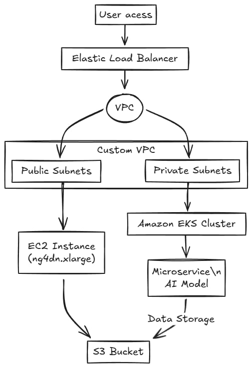
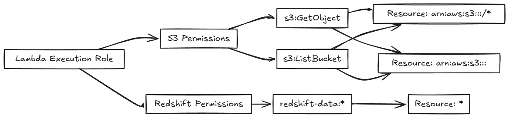

# Prueba Técnica para DevOps Senior

Configurar una arquitectura en AWS para soportar un modelo de transcripción basado en IA, requiere configurar credenciales AWS con `aws-cli` para gestionar recursos.

### Requirements

- `Python`: 3.8.x and greater
- `Terraform`: 1.10.4 latest
- `Docker` y `DockerHub`

## 1. Infraestructura en la Nube

Todas las creaciones de recursos son realizables mediante CLI o directamente en su Amazone Console, ajustando dinamicamente cada parametro.

```bash
aws ec2 run-instances \
--image-id ami-0abcdef1234567890 \
--instance-type t2.micro \
--security-group-ids sg-903004f8 \
--subnet-id subnet-6e7f829e
```

```bash
aws s3api create-bucket --bucket my-bucket --region us-west-2
```

```bash
aws eks create-cluster \
--name my-cluster \
--role-arn arn:aws:iam::<account-id>:role/<role-name> \
--resources-vpc-config subnetIds=<subnet-1>,<subnet-2>,securityGroupIds=<security-group>
```

Automaticamente se asigna una VPC son subredes, según sean los parametros por defecto, o si queremos a nivel de usuario o roles. En general, la arquitectura planteada es la siguiente [`Excalidraw Source`](https://excalidraw.com/),




## 2. Pipeline de CI/CD

Una solución basada en **GitHub Actions** que implementa un pipeline CI/CD para la integración de un modelo de transcripción en un clúster de EKS, anteriormente creado. Este pipeline incluye pruebas unitarias, construcción de imágenes en DockerHub y despliegue automatizado.

### Configuration
1. **GitHub Secrets**: `AWS_ACCESS_KEY_ID` y `AWS_SECRET_ACCESS_KEY` son credenciales de AWS para acceder a los recursos (EKS).
3. **Imagenes en DockerHub**: `DOCKER_USERNAME` y `DOCKER_TOKEN` son credenciales de DockerHub para acceder a las imagenes del modelo.
2. **Manifiestos Kubernetes (`./eks`)**: Encontramos todas las configuraciones necesarias según el paso a paso de la documentación EKS Quickstart.
4. **Despliegue Github Actions**: `.github\workflows\deploy.yml` con cada job que realiza el deploy para realizar el CI/CD.


## 3. Gestión de Datos y Data Warehouse

El pipeline propuesto consta de tres componentes principales:

- Extracción de datos desde S3: Un evento en S3 (subida de un archivo) activa la función Lambda.
- Procesamiento de datos mediante `Lambda Functions`:
  - La función Lambda procesa la grabación (transcripción, extracción de metadatos, etc.).
  - Los resultados se formatean en `TABLE` para su carga.
- UPLOAD en Amazon Redshift: La función Lambda utiliza la funcionalidad `psycopg2.connect` para cargar los datos procesados al datalake.

### Amazon Redshift
Esquema de la base de datos con los campos `text` para la transcripción y `timestamp` para verificar la hora de subida y procesamiento,
```sql
CREATE TABLE transcripts (
  ID VARCHAR(50) PRIMARY KEY,
  text varchar (255)
);
```

### Permisos IAM
Roles y políticas necesarias para acceder a S3 y Redshift.



1. VPC Lambda: Se encuentra configurado para ejecutarse en la misma VPC con los subnets y security groups adecuados.
2. S3 Event Notification: Configura el bucket S3 para que active un evento cuando se suba un archivo:
   - **Evento:** `s3:ObjectCreated: *`.
   - **Destino:** `Lambda Function`.

### Variables de Entorno
- `REDSHIFT_HOST`
- `REDSHIFT_PORT`
- `REDSHIFT_DBNAME`
- `REDSHIFT_USER`
- `REDSHIFT_PASSWORD`
- `REDSHIFT_TABLE`
- `EKS_ENDPOINT`


## 4. Monitoreo y Observabilidad
El sistema de monitoreo utiliza **CloudWatch** para visualizar métricas, rastrear el rendimiento y configurar alertas para detectar fallos críticos.
](assets/dashboard.png)

### Monioreo del clúster EKS y Lambda Functions
- Duración de la ejecución: Tiempo que toma la función en completarse.
- Tasa de invocación: Número de ejecuciones por minuto.
- Errores: Número de errores durante la ejecución.
- Utilización de CPU y memoria por nodo.
- Estado de los pods (running, pending, failed).
- Tasa de errores en servicios.

Ejemplo de consulta de logs para mostrar errores en aplicaciones:
```bash
fields @timestamp, @message
| filter @message like /ERROR/
| sort @timestamp desc
```


## 5. Preguntas Teóricas

### **1. ¿Cómo garantizarías la seguridad de las credenciales almacenadas en los pipelines?**

1. **Almacenamiento en gestores de secretos:**
   - Utilizar servicios como **AWS Secrets Manager** para almacenar credenciales sensibles (tokens, claves API, contraseñas).
   - Acceder a las credenciales directamente desde el pipeline mediante integraciones con estos gestores.
2. **Variables de entorno cifradas:**
   - Configurar las credenciales como variables de entorno en los sistemas CI/CD (GitHub Actions, Jenkins, GitLab).
   - Asegurarse de que estas variables estén cifradas y solo accesibles durante la ejecución del pipeline.
3. **Principio de menor privilegio:**
   - Asignar solo los permisos estrictamente necesarios para cada credencial.
   - Usar roles IAM temporales en lugar de credenciales estáticas para interactuar con servicios como AWS.
4. **Rotación automática de credenciales:**
   - Implementar mecanismos de rotación periódica para las credenciales.
   - Automatizar la actualización de los secretos almacenados.

#### 2. Explica una estrategia para escalar dinámicamente los microservicios según la carga de trabajo.

1. **Configurar un controlador de escalado automático (Horizontal Pod Autoscaler - HPA):** En un clúster Kubernetes, usar el **HPA** para ajustar el número de pods según las métricas observadas.
2. **Uso de escalado vertical automático (Vertical Pod Autoscaler - VPA):** Ajusta los recursos asignados (CPU/memoria) a los pods individuales en función de la carga.
3. **Escalado basado en eventos:**
   - Utilizar soluciones como **KEDA** (Kubernetes Event-Driven Autoscaler) para escalar microservicios según eventos, como mensajes en una cola (Amazon SQS, Kafka) o solicitudes HTTP.
4. **Pruebas de estrés y ajuste de límites:**
   - Realizar pruebas de carga para determinar los límites de cada servicio.
   - Configurar políticas de calidad de servicio (QoS) en Kubernetes para priorizar recursos.

Con esta estrategia, los microservicios pueden responder dinámicamente a la carga de trabajo, manteniendo la disponibilidad y optimizando el uso de recursos. 😊


## More Resources

- [`GitHub Actions`](https://docs.github.com/es/actions/)
- [`AWS CLI Documentation`](https://docs.aws.amazon.com/cli/index.html/)
- [`AWS EKS Quickstart Documentation`](https://docs.aws.amazon.com/eks/latest/userguide/quickstart.html/)
- [`Cloudwatch Documentation`](https://docs.aws.amazon.com/cloudwatch/)